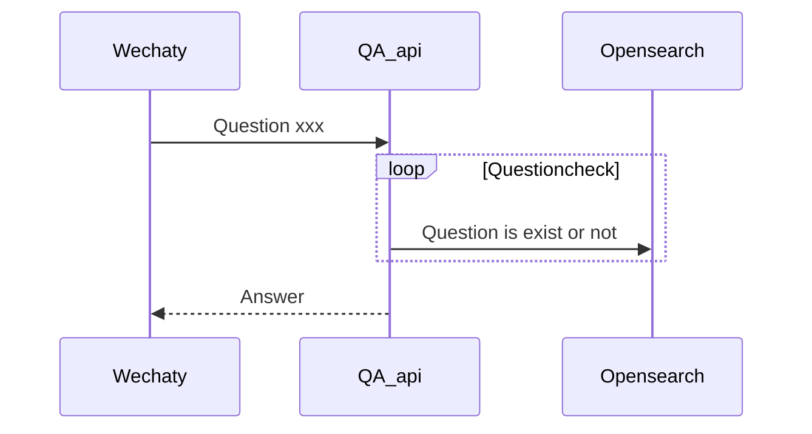
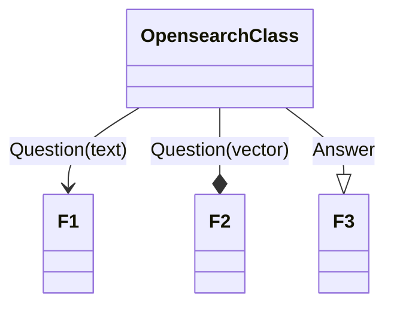

#

## idea tree





```mermaid
flowchart TD 
   %% A[Start] --> B{I?}
%%B -- Yes --> C[OK]
%%    C --> D[Rethink]
  %%  D --> B
    %%B -- No ----> E[End]
```

```mermaid
flowchart LR
  subgraph Opensearch
    direction TB
    subgraph B1
       %% direction LR
        DATA_1 --> Q_text_1
        DATA_1 --> Q_vec_1
        DATA_1 --> Q_ans_1
    end
    subgraph B2
       %% direction LR
        DATA_2 --> Q_text_2
        DATA_2 --> Q_vec_2
        DATA_2 --> Q_ans_2
    end
    subgraph B3
        ...

    end
  end
  Q_text_x --> Opensearch --> Q_ans_X
  Opensearch --> Q_vec_X
  Opensearch --> Q_text_X

  B1 --> B2
  B2 --> B3
  ```

## WIKI

~~当csv数据更新的时候 或想实现其他功能的时候 需要使用新的索引[create_index.py](#create_index.py) ，对于此项目包含每一个数据的构造。 如 idea tree , 每一个 data 中都含有 Q_text , Q_vec , Q_ans 三个属性 分别对应标准查询问题，及其对应的向量，以及Q_ans 对应的回答。~~
~~当接收到文字讯息时候，将字符串x传入 Opensearch 进行检索 得到对应的 data_X 通过返回的信息可以知道 包含对应的 文字问题，文字问题向量，以及对应答案。 通过返回的文字问题向量与输入文字进行比对，来估计检索的可信度。~~

由于 [opensearch](#https://opensearch.org/) 支持 [knn](https://opensearch.org/docs/latest/search-plugins/knn/index/) 搜索 所以上述方式已沦为笑话😂 下面为opensearch [knn 相关调试记录](#相关调试记录)

### 相关调试记录


### create_index.py

1. **Adding document:**

```python
document = {
  'Q_text': 'A BC',
  'Q_vec': '123', # for test
  'Answer': 'abc'
}
id = '1'

response = client.index(
    index = index_name,
    body = document,
    id = id,
    refresh = True
)

print(response)

```

2. **Test search key**

```python
q = 'BC'
query = {
  'size': 5,
  'query': {
    'multi_match': {
      'query': q,
      # 'fields': ['title^2', 'director']  # 'director'
      'fields': ['Q_text']
    }
  }
}

response = client.search(
    body = query,
    index = index_name
)

print('\nSearch results:')
print(response)
```

Output

```bash
Search results:
{'took': 2, 'timed_out': False, '_shards': {'total': 4, 'successful': 4, 'skipped': 0, 'failed': 0}, 'hits': {'total': {'value': 1, 'relation': 'eq'}, 'max_score': 0.60996956, 'hits': [{'_index': 'abc_test_index', '_type': '_doc', '_id': '1', '_score': 0.60996956, '_source': {'Q_text': 'A BC', 'Q_vec': '123', 'Answer': 'abc'}}]}}
```
