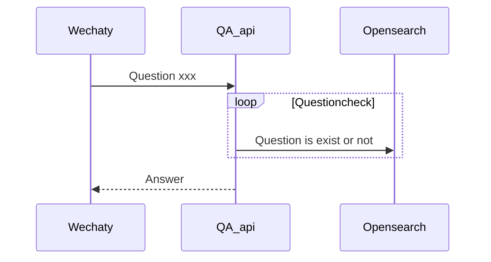
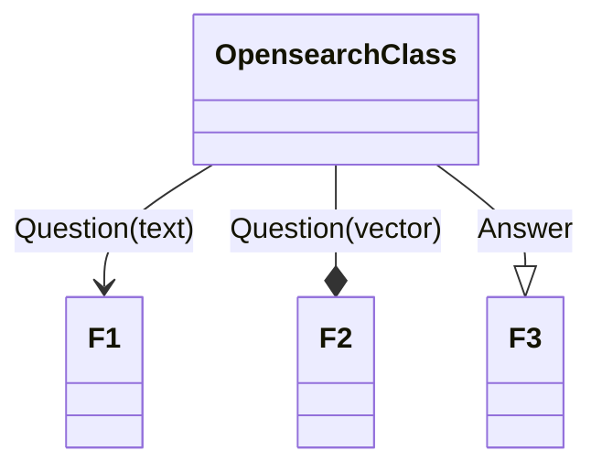

# idea tree





```mermaid
flowchart TD 
   %% A[Start] --> B{I?}
%%B -- Yes --> C[OK]
%%    C --> D[Rethink]
  %%  D --> B
    %%B -- No ----> E[End]
```

```mermaid
flowchart LR
  subgraph Opensearch
    direction TB
    subgraph B1
       %% direction LR
        DATA_1 --> Q_text_1
        DATA_1 --> Q_vec_1
        DATA_1 --> Q_anser_1
    end
    subgraph B2
       %% direction LR
        DATA_2 --> Q_text_2
        DATA_2 --> Q_vec_2
        DATA_2 --> Q_anser_2
    end
    subgraph B3
        ...

    end
  end
  Q_5 --> Opensearch --> Q_A_5
  B1 --> B2
  B2 --> B3
  ```